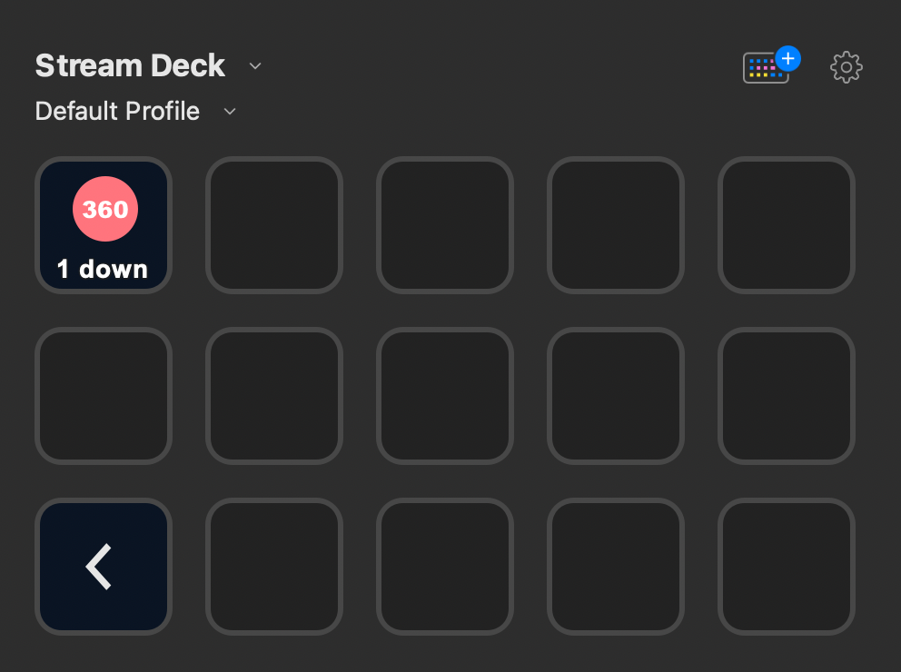

# Stream Deck 360 Monitoring Plugin

This plugin shows the number of websites that are down.

## Release Notes

- **Version 0.1 - Proof of Concept**
    - Data is fetched every minute via the Platform 360 API.
    - 360 handle is hard coded
    - If websites are down the 360 icon turns red
    - Click on the button open the 360 Monitoring dashboard for websites

## Future / Ideas

- Use [Property Inspector](https://developer.elgato.com/documentation/stream-deck/sdk/property-inspector/) to set the
  Platform 360 handle
- Play sound if the number of errors changes
- Allow server stats as well